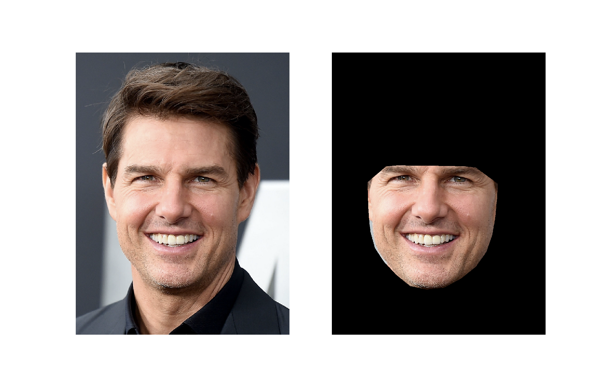
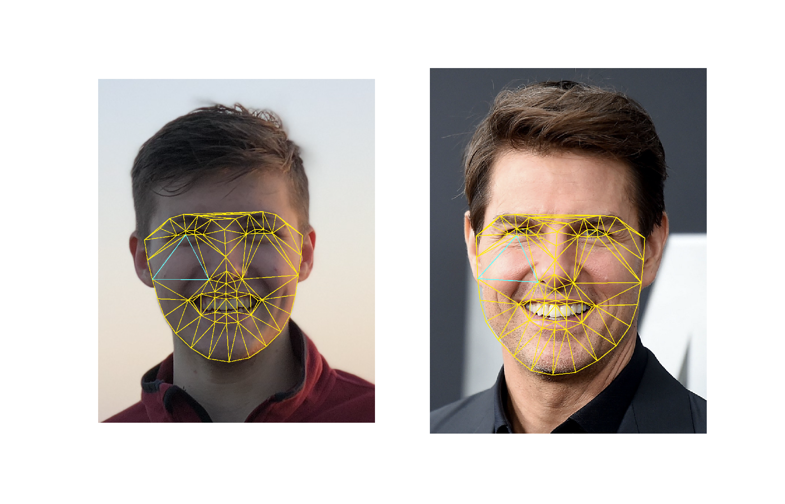
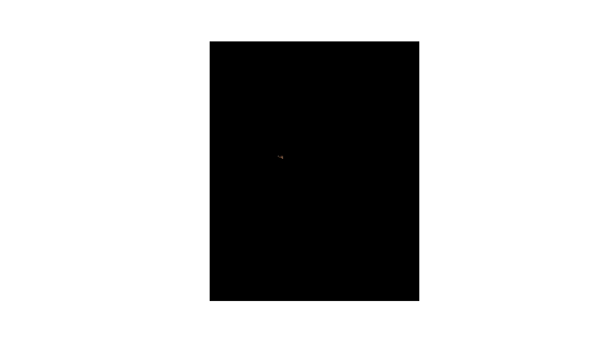
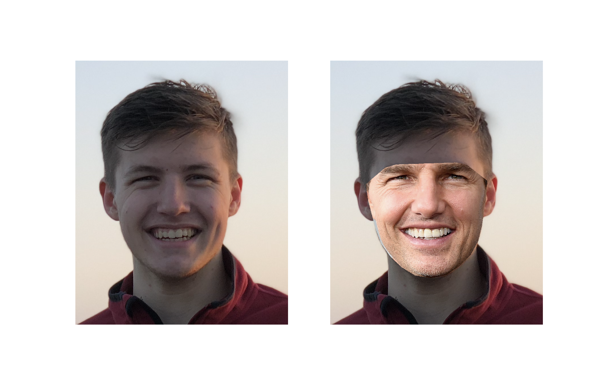
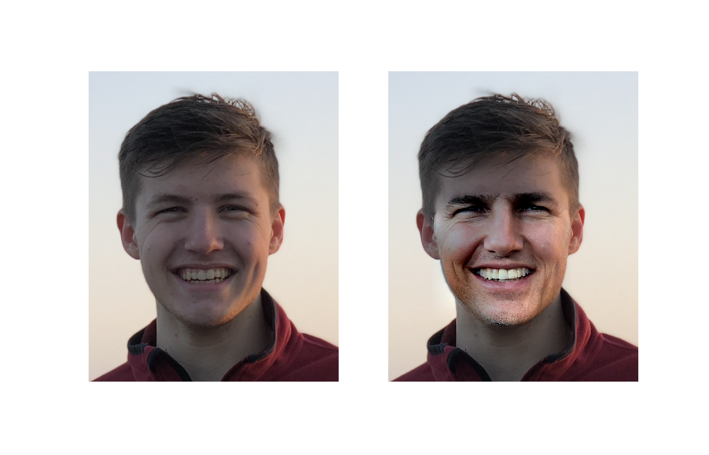
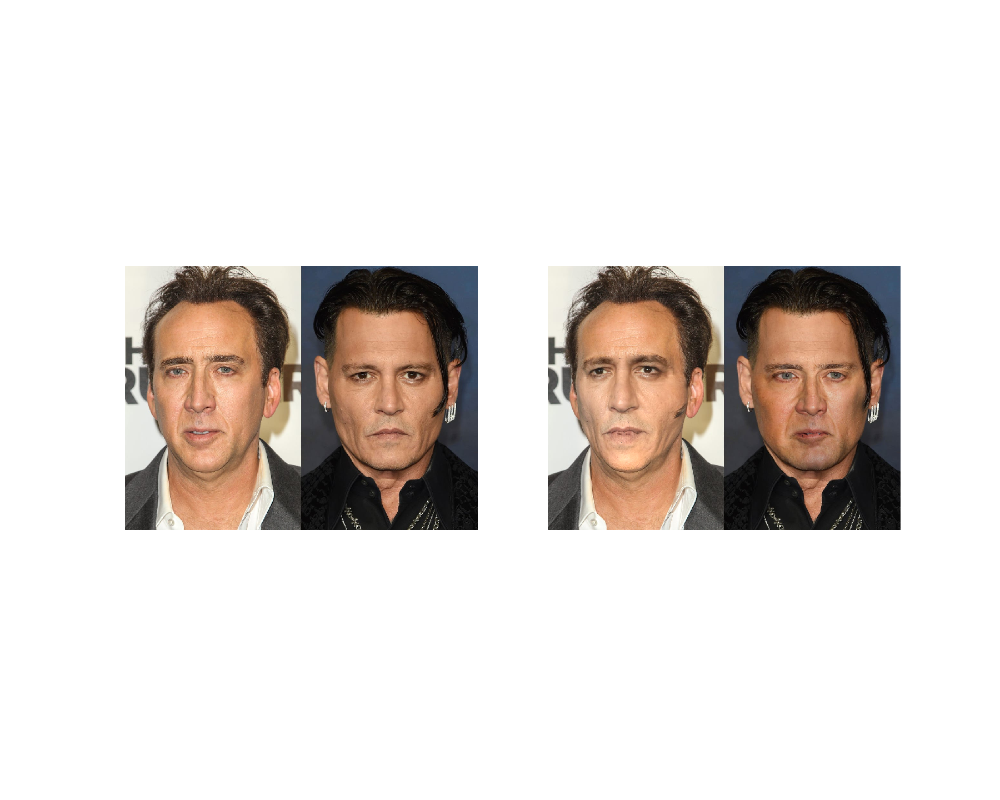

# Fase Swapping

## Step-by-step solution
Based on this [solution](https://pysource.com/2019/05/28/face-swapping-explained-in-8-steps-opencv-with-python/).
### 1. Face detection

### 2. Keypoints detection

### 3. Face cropping

### 4. Face triangulation

### 5. Reconstruction new face

### 6. Pull up new face

### 6. Seamless Cloning

## Examples

## Techology part
The most of the algorithms are written using [openCV](https://pypi.org/project/opencv-python/)

* Face detection: **Haar Cascade**
* Keypoint detection: **The cascade of regressors** using [dlib](http://dlib.net) based on this [paper](http://www.nada.kth.se/~sullivan/Papers/Kazemi_cvpr14.pdf)
* Face triangulation: simple **Triangulation**
* Reconstruction: **Affine projection** each triangles 
* Color alignment: **Seamless Cloning** ([details](http://amroamroamro.github.io/mexopencv/opencv/cloning_demo.html))
